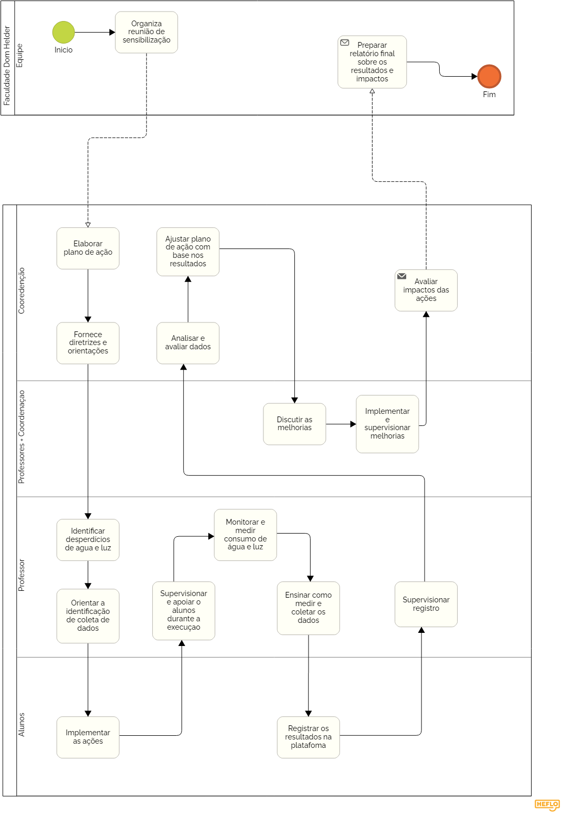
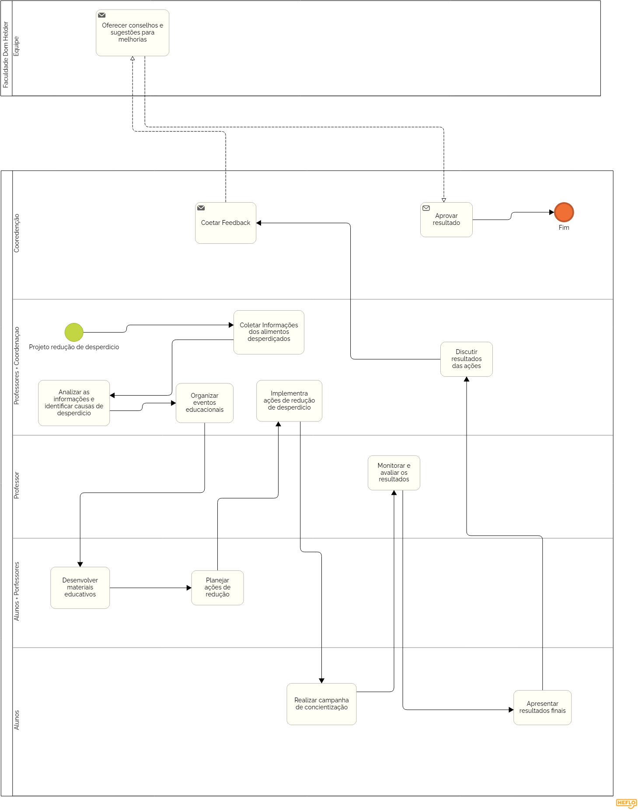
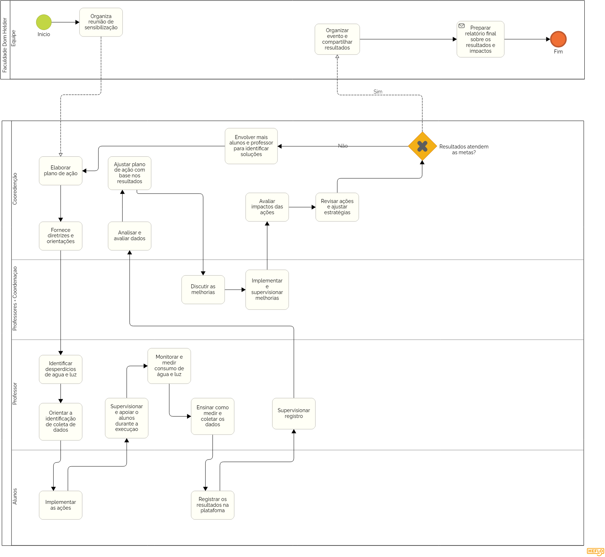
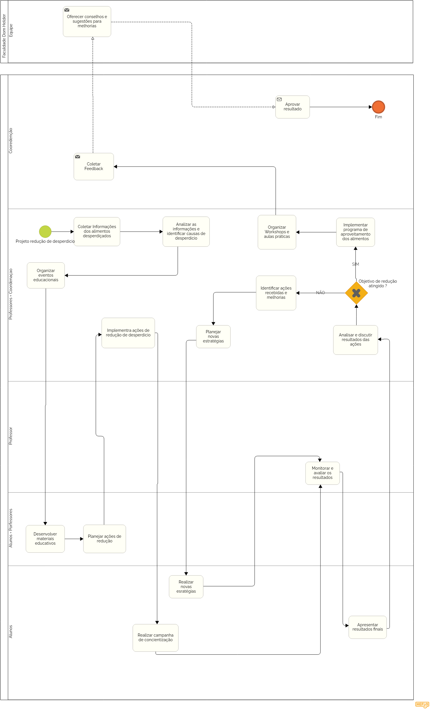

# Modelagem dos processos de negócio

Pré-requisitos: <a href="02-Especificacao.md"> Especificação do projeto</a>

> **Links úteis**:
> - [Modelagem de processos AS-IS x TO-BE](https://dheka.com.br/modelagem-as-is-to-be/)
> - [20 dicas práticas de modelagem de processos](https://dheka.com.br/20-dicas-praticas-de-modelagem-de-processos/)

## Modelagem da situação atual (Modelagem AS IS)

<!-- Apresente uma descrição textual de como os sistemas atuais resolvem o problema que seu projeto se propõe a resolver. Caso sua proposta seja inovadora e não existam processos claramente definidos, apresente como as tarefas que seu sistema pretende implementar são executadas atualmente, mesmo que não se utilize tecnologia computacional.

Com o tema do projeto definido, escolham alguns processos no contexto de negócios. Para ilustrar os potenciais ganhos com a automatização, imaginem processos manuais, ineficientes e/ou com muitas idas e vindas, gerando, assim, retrabalho. Colem aqui os modelos dos processos atuais (modelo AS-IS), elaborados com o apoio da ferramenta baseada em BPMN utilizada na disciplina. -->

Este sistema resolve o problema da conscientização e redução de desperdícios de água e luz ao envolver todas as partes da instituição em um ciclo de planejamento, execução, monitoramento e melhoria contínua. O processo é supervisionado pela coordenação e professores, enquanto os alunos realizam a coleta de dados e implementam ações concretas.

Esse fluxo de trabalho busca engajar múltiplas partes em um ciclo contínuo de planejamento, execução e avaliação de ações voltadas para a redução de desperdícios de alimentos. O processo envolve coordenação, supervisão e participação ativa de alunos e professores, o que permite uma abordagem educativa e colaborativa.

## Descrição geral da proposta (Modelagem TO BE)

<!-- Tendo identificado os gargalos dos modelos AS-IS, apresentem uma descrição da proposta de solução, buscando maior eficiência com a introdução da tecnologia. Abordem também os limites dessa solução e seu alinhamento com as estratégias e objetivos do contexto de negócio escolhido.

Cole aqui os modelos da solução proposta (modelo TO-BE), elaborados com o apoio da ferramenta baseada em BPMN utilizada na disciplina. Cada processo identificado deve ter seu modelo TO-BE específico. Descrevam as oportunidades de melhoria de cada processo da solução proposta. -->

Esse processo coloca grande foco na avaliação constante dos resultados além do foco na redução de desperdícios, porém com mais ênfase em ajustes contínuos e envolvimento de alunos e professores para alcançar as metas. Caso as metas não sejam atingidas, o ciclo é revisado com o envolvimento de mais alunos e professores, o que torna o processo dinâmico e adaptativo. Isso garante que, mesmo se os objetivos iniciais não forem alcançados, o projeto possa ser ajustado para obter melhores resultados.

O processo visa a redução de desperdícios em um ambiente educacional, utilizando um ciclo de melhoria contínua que envolve a coleta e análise de dados, a implementação de estratégias educativas e práticas, e a avaliação dos resultados. Após coletar informações sobre os alimentos desperdiçados e identificar suas causas, são organizados workshops e programas para conscientizar e reduzir o desperdício. O progresso é monitorado continuamente, e novas estratégias são desenvolvidas caso os objetivos não sejam atingidos, sempre promovendo a conscientização e o engajamento de todos os envolvidos.

<!-- Apresente aqui uma descrição da sua proposta, abordando seus limites e suas ligações com as estratégias e objetivos do negócio. Apresente também as oportunidades de melhoria. -->

## Modelagem dos processos

[PROCESSO 1 - Nome do processo](./processes/processo-1-nome-do-processo.md "Detalhamento do processo 1.")

[PROCESSO 2 - Nome do processo](./processes/processo-2-nome-do-processo.md "Detalhamento do processo 2.")

## Indicadores de desempenho

Apresente aqui os principais indicadores de desempenho e algumas metas para o processo. Atenção: as informações necessárias para gerar os indicadores devem estar contempladas no diagrama de classe. Coloque no mínimo 5 indicadores.

Use o seguinte modelo:

| **Indicador** | **Objetivos** | **Descrição** | **Fonte de dados** | **Fórmula de cálculo** |
| ---           | ---           | ---           | ---             | ---             |
| Percentual de redução de desperdícios  | Avaliar a eficiência das ações de redução de desperdício de alimentos | Percentual de alimentos que deixaram de ser desperdiçados                   | Tabela de Coleta de Dados   | (quantidade de alimentos antes - quantidade de alimentos após) / quantidade antes * 100                    |
| Percentual de Redução no Consumo de Água e Energia | Avaliar a efetividade das ações de redução no consumo de água e energia | Percentual de redução no consumo de água e energia após a implementação das melhorias | Tabela de Consumo de Água e Energia   | (consumo antes - consumo depois) / consumo antes * 100                                                      |
| Índice de reaproveitamento de alimentos| Mensurar a quantidade de alimentos que foram reaproveitados | Percentual de alimentos reaproveitados em relação ao total disponível       | Tabela de Coleta de Dados   | (quantidade de alimentos reaproveitados / quantidade total de alimentos disponíveis) * 100                  |
| Taxa de Participação nas Ações Educativas | Monitorar o engajamento dos alunos e professores nas ações de redução de água, luz e alimentos | Percentual de alunos e professores que participam dos workshops e eventos  | Tabela de Participação      | (número de participantes / total de convidados) * 100                                                       |
| Satisfação com as Ações Implementadas     | Avaliar a percepção dos alunos e professores sobre as melhorias nas áreas de água, luz e alimentos | Percentual de satisfação com as ações implementadas nos workshops e aulas         | Tabela de Feedback          | (número de respostas positivas / número total de respostas) * 100                                          |

Obs.: todas as informações necessárias para gerar os indicadores devem estar no diagrama de classe a ser apresentado posteriormente.
