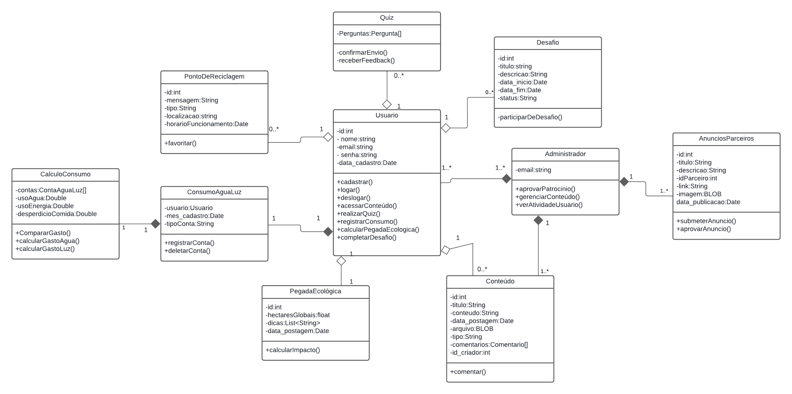
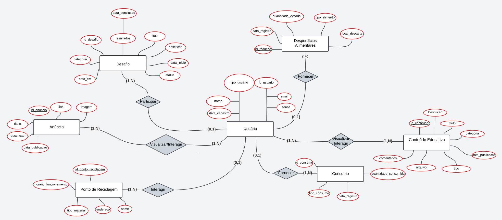
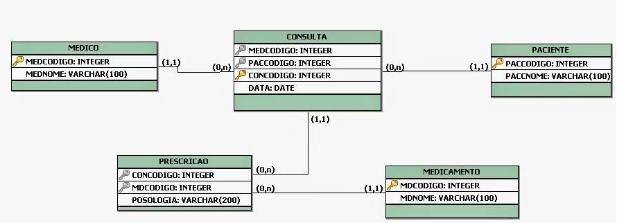
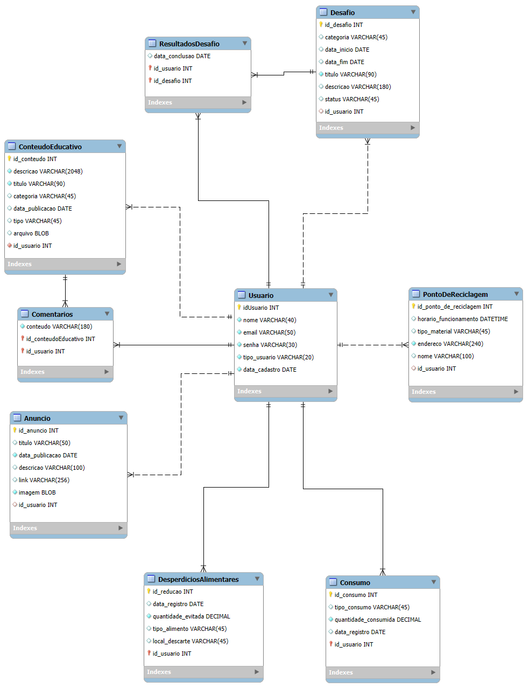

# Arquitetura da solução


## Diagrama de classes

O diagrama de classes ilustra graficamente a estrutura do software e como cada uma das classes estará interligada. Essas classes servem de modelo para materializar os objetos que serão executados na memória.



##  Modelo ER




### Esquema relacional

O Esquema Relacional corresponde à representação dos dados em tabelas juntamente com as restrições de integridade e chave primária.
 
<!--

-->

---


### Modelo físico

Insira aqui o script de criação das tabelas do banco de dados.

Veja um exemplo:
<!--
```sql
-- Criação da tabela Medico
CREATE TABLE Medico (
    MedCodigo INTEGER PRIMARY KEY,
    MedNome VARCHAR(100)
);

-- Criação da tabela Paciente
CREATE TABLE Paciente (
    PacCodigo INTEGER PRIMARY KEY,
    PacNome VARCHAR(100)
);

-- Criação da tabela Consulta
CREATE TABLE Consulta (
    ConCodigo INTEGER PRIMARY KEY,
    MedCodigo INTEGER,
    PacCodigo INTEGER,
    Data DATE,
    FOREIGN KEY (MedCodigo) REFERENCES Medico(MedCodigo),
    FOREIGN KEY (PacCodigo) REFERENCES Paciente(PacCodigo)
);

-- Criação da tabela Medicamento
CREATE TABLE Medicamento (
    MdcCodigo INTEGER PRIMARY KEY,
    MdcNome VARCHAR(100)
);

-- Criação da tabela Prescricao
CREATE TABLE Prescricao (
    ConCodigo INTEGER,
    MdcCodigo INTEGER,
    Posologia VARCHAR(200),
    PRIMARY KEY (ConCodigo, MdcCodigo),
    FOREIGN KEY (ConCodigo) REFERENCES Consulta(ConCodigo),
    FOREIGN KEY (MdcCodigo) REFERENCES Medicamento(MdcCodigo)
);
```
-->
```sql
-- Criação da tabela Usuário
CREATE TABLE Usuario (
    idUsuario INTEGER NOT NULL PRIMARY KEY,
    nome VARCHAR(40) NOT NULL,
    email VARCHAR(50) NOT NULL,
    senha VARCHAR(30) NOT NULL,
    tipo_usuario VARCHAR(20) NOT NULL,
    data_cadastro DATE NOT NULL
);
-- Criação da tabela Anúncio
CREATE TABLE Anuncio (
    id_anuncio INTEGER NOT NULL PRIMARY KEY,
    titulo VARCHAR(50),
    data_publicacao DATE NOT NULL,
    descricao VARCHAR(100),
    link VARCHAR(256),
    imagem BLOB NOT NULL,
    id_usuario INTEGER,
    FOREIGN KEY (id_usuario) REFERENCES Usuario(idUsuario)
);
-- Criação da tabela Conteúdo Educativo
CREATE TABLE ConteudoEducativo (
    id_conteudo INTEGER NOT NULL PRIMARY KEY,
    descricao VARCHAR(2048) NOT NULL,
    titulo VARCHAR(90) NOT NULL,
    categoria VARCHAR(45),
    data_publicacao DATE,
    tipo VARCHAR(45),
    arquivo BLOB,
    id_usuario INTEGER NOT NULL,
    FOREIGN KEY (id_usuario) REFERENCES Usuario(idUsuario)
);
-- Criação da tabela Comentários
CREATE TABLE Comentarios (
    conteudo VARCHAR(180) NOT NULL,
    id_conteudoEducativo INTEGER NOT NULL,
    id_usuario INTEGER NOT NULL,
    PRIMARY KEY (id_conteudoEducativo, id_usuario),
    FOREIGN KEY (id_conteudoEducativo) REFERENCES ConteudoEducativo(id_conteudo),
    FOREIGN KEY (id_usuario) REFERENCES Usuario(idUsuario)
);
-- Criação da tabela Desafio
CREATE TABLE Desafio (
    id_desafio INTEGER NOT NULL PRIMARY KEY,
    categoria VARCHAR(45),
    data_inicio DATE,
    data_fim DATE,
    titulo VARCHAR(90) NOT NULL,
    descricao VARCHAR(180),
    status VARCHAR(45),
    id_usuario INTEGER,
    FOREIGN KEY (id_usuario) REFERENCES Usuario(idUsuario)
);
-- Criação da tabela Desperdícios Alimentares
CREATE TABLE DesperdiciosAlimentares (
    id_reducao INTEGER NOT NULL,
    data_registro DATE,
    quantidade_evitada DECIMAL NOT NULL,
    tipo_alimento VARCHAR(45),
    local_descarte VARCHAR(45),
    id_usuario INTEGER NOT NULL,
    PRIMARY KEY (id_reducao, id_usuario),
    FOREIGN KEY (id_usuario) REFERENCES Usuario(idUsuario)
);
-- Criação da tabela Consumo
CREATE TABLE Consumo (
    id_consumo INTEGER NOT NULL,
    tipo_consumo VARCHAR(45),
    quantidade_consumida DECIMAL NOT NULL,
    data_registro DATE,
    id_usuario INTEGER NOT NULL,
    PRIMARY KEY (id_consumo, id_usuario),
    FOREIGN KEY (id_usuario) REFERENCES Usuario(idUsuario)
);
-- Criação da tabela Resultados Desafio
CREATE TABLE ResultadosDesafio (
    data_conclusao DATE,
    id_usuario INTEGER NOT NULL,
    id_desafio INTEGER NOT NULL,
    PRIMARY KEY (id_usuario, id_desafio),
    FOREIGN KEY (id_usuario) REFERENCES Usuario(idUsuario),
    FOREIGN KEY (id_desafio) REFERENCES Desafio(id_desafio)
);
-- Criação da tabela Ponto de Reciclagem
CREATE TABLE PontoDeReciclagem (
    id_ponto_de_reciclagem INTEGER NOT NULL PRIMARY KEY,
    horario_funcionamento DATETIME,
    tipo_material VARCHAR(45),
    endereco VARCHAR(240) NOT NULL,
    nome VARCHAR(100),
    id_usuario INTEGER,
    FOREIGN KEY (id_usuario) REFERENCES Usuario(idUsuario)
);
```
Esse script deverá ser incluído em um arquivo .sql na pasta [de scripts SQL](../src/db).


## Tecnologias

| **Dimensão**   | **Tecnologia**  |
| ---            | ---             |
| IDE            | Visual Studio Code |
| Front-end      | HTML + CSS + JS + Bootstrap|
| Back-end       | Node.js         |
| SGBD           | MySQL           |
| Deploy         | Vercel          |

- **IDE | Visual Studio Code:** Editor de código que facilita o desenvolvimento fornecendo extensões e ferramentas.
- **Front-end | HTML + CSS + JS:** HTML fornece a estrutura e o conteúdo do projeto, o CSS define o estilo e a aparência visual, o JavaScript  adiciona funcionalidades dinâmicas e interativas, o Bootstrap é um framework front-end utilizado para facilitar a estilização e padronização.
- **Back-end | Node.js:** Permite que o JavaScript seja executado no servidor, processando dados e gerenciando a lógica do projeto.
- **SGBD | MySQL:** Sistema de gerenciamento de banco de dados(SGBD) relacional que permite armazenar, organizar e recuperar dados.
- **Deploy | Vercel:**  Plataforma de hospedagem que permite implantar, gerenciar e distribuir aplicações web.
  
## Hospedagem

Explique como a hospedagem e o lançamento da plataforma foram realizados.


## Qualidade de software

<!--
Conceituar qualidade é uma tarefa complexa, mas ela pode ser vista como um método gerencial que, por meio de procedimentos disseminados por toda a organização, busca garantir um produto final que satisfaça às expectativas dos stakeholders.

No contexto do desenvolvimento de software, qualidade pode ser entendida como um conjunto de características a serem atendidas, de modo que o produto de software atenda às necessidades de seus usuários. Entretanto, esse nível de satisfação nem sempre é alcançado de forma espontânea, devendo ser continuamente construído. Assim, a qualidade do produto depende fortemente do seu respectivo processo de desenvolvimento.

A norma internacional ISO/IEC 25010, que é uma atualização da ISO/IEC 9126, define oito características e 30 subcaracterísticas de qualidade para produtos de software. Com base nessas características e nas respectivas subcaracterísticas, identifique as subcaracterísticas que sua equipe utilizará como base para nortear o desenvolvimento do projeto de software, considerando alguns aspectos simples de qualidade. Justifique as subcaracterísticas escolhidas pelo time e elenque as métricas que permitirão à equipe avaliar os objetos de interesse.
-->

Nós da GreenMind temos como base para nortear o desenvolvimento do nosso projeto de software as seguintes subcaracterísticas:
- **Disponibilidade:** A disponibilidade é um dos nossos principais focos visto que queremos fornecer ferramentas educativas e caso o site não esteja disponível podemos acabar perdendo um potencial estudante.
- **Comportamento do tempo:** Um longo tempo de espera é exaustivo e desestimulante para o usuário que pode acabar desistindo de usar o projeto devido a lentidão do mesmo, logo é importante para nós da Greenmind tempos de resposta rápidos.
- **Confidencialidade:** Um site tem que garantir que os seus dados confidenciais e os dados dos seus usuários vão estar protegidose isso é de extrema importância para que nós forneçamos valor aos usuários e não dor de cabeça.
- **Interoperabilidade:** Visto que o GreenMind possui banco de dados, back-end e front-end é importante que a troca de informações e o trabalho em conjunto entre essas diferentes partes aconteça.


